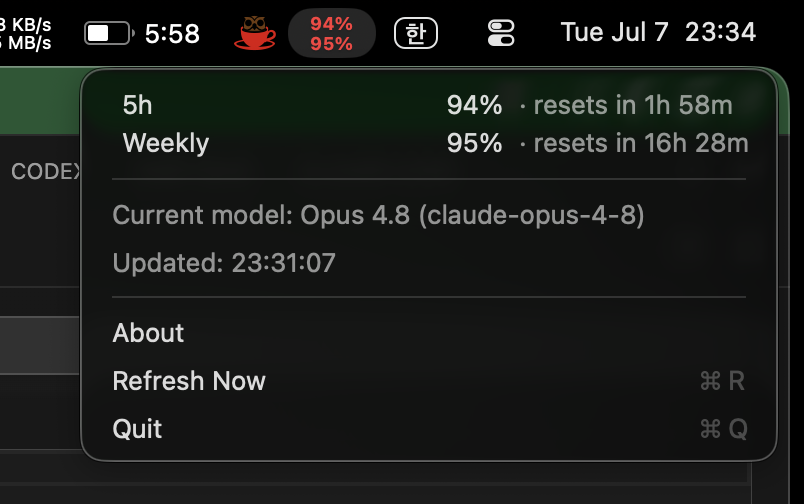
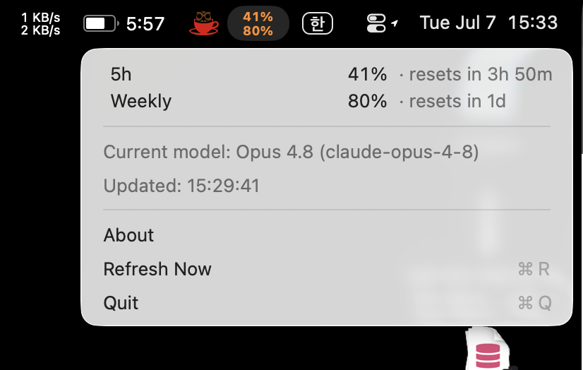

# Pulse

Always-visible display of **Claude Code's 5-hour / weekly usage** (plus the current model) — in your VSCode status bar, system tray, or macOS menu bar.

It reads the same data the `/usage` command uses. No separate login, no API key: if you are signed in to Claude Code, it works right away.

[](LICENSE)

<p align="center">
  
</p>

<p align="center"><em>The macOS menu bar app — a compact <code>5h / weekly %</code> gauge, with a dropdown for reset times and the current model. The gauge turns orange, then red, as usage climbs.</em></p>

## Implementations

The same core logic, ported to three platform UIs:

| Folder | Surface | Stack | Notes |
| --- | --- | --- | --- |
| [`src/`](src/) | VSCode status bar | TypeScript + esbuild | Reference implementation (documented below) |
| [`tray-go/`](tray-go/) | Windows / macOS system tray | Go ([`systray`](https://github.com/getlantern/systray)) | Single ~7MB binary, no dependencies |
| [`menubar/`](menubar/) | macOS menu bar | Swift / AppKit | Menu-bar only app (no Dock icon), macOS 13+ |

`src/` is the reference implementation; `tray-go/` and `menubar/` are hand-ports of the same four-module design. See the README in each folder for platform-specific details:
[`menubar/README.md`](menubar/README.md) · [`tray-go/README.md`](tray-go/README.md)

## What it shows

- Status text such as `5h 42% · wk 8% · Opus 4.8` — 5-hour window, weekly window, current model
- Details on hover / in the dropdown: time until each window resets, weekly Opus/Sonnet split, current model ID, last update time
- Color warning when usage is high: warn at 80%, alert at 95% (configurable in the VSCode extension)
- Click / menu action to refresh immediately

## How it works

1. **Credentials** — reads the OAuth access token Claude Code already stores locally, **strictly read-only** (Pulse never refreshes or writes Claude Code's credentials):
   - Windows / Linux: `~/.claude/.credentials.json`
   - macOS: the file above if present, otherwise the keychain item `Claude Code-credentials`

   The token is cached in memory. Each poll only checks a change fingerprint (file mtime / keychain modification date — a metadata read that never triggers a keychain prompt); the secret itself is re-read only when Claude Code actually rotates the token or the API rejects the cached one.
2. **Usage API** — calls the same endpoint the `/usage` command uses: `GET https://api.anthropic.com/api/oauth/usage`. The response contains utilization and reset time for the 5-hour, weekly, weekly-Opus, and weekly-Sonnet windows.
3. **Current model** (best-effort) — reads the `model` field from the last line of your most recent session transcript under `~/.claude/projects/`. Only that one field is read; conversation content is never parsed.
4. **Formatting** — pure functions turn that into the status text, tooltip, and "resets in 1h 50m" strings. This is where the unit tests live.

### macOS keychain prompts

On macOS, Claude Code stores its credentials only in the keychain, and that item is protected by an ACL owned by Claude Code — so the **first** time Pulse reads the token after a launch or after Claude Code rotates it, macOS shows a "wants to access key … in your keychain" prompt. Click **Allow** (with an ad-hoc-signed build, "Always Allow" does not persist across rebuilds). Thanks to the fingerprint cache this is bounded: expect roughly one prompt per app launch/reboot plus one per token rotation — never one per poll.

If you deny the prompt, Pulse shows "Keychain access denied. Use Refresh Now to try again." and stops touching the keychain until you use **Refresh Now** or the credentials change.

To avoid keychain prompts entirely, you can provide a token directly via the `CLAUDE_USAGE_TOKEN` environment variable (for example a long-lived token from `claude setup-token`). When set, Pulse uses it as-is and never reads Claude Code's credential stores.

### Privacy

- Your token is read from Claude Code's local storage, kept **in memory only**, and sent to `api.anthropic.com` over HTTPS — nowhere else.
- No telemetry, no analytics, no data written to disk.
- Transcript scanning reads only the `model` field of the most recent session.

### Disclaimer

Pulse is an independent open-source project, **not affiliated with or endorsed by Anthropic**. Claude is a trademark of Anthropic, PBC. The usage endpoint is not a documented public API and may change or stop working at any time.

## VSCode extension

### Install / build

```bash
npm install
npm run package            # bundle → dist/extension.js
npx @vscode/vsce package   # → pulse-<version>.vsix
code --install-extension pulse-0.3.0.vsix
```

For development: open this folder in VSCode and press `F5` (Extension Development Host), or `npm run watch` to rebuild on change.

### Settings

| Setting | Default | Description |
| --- | --- | --- |
| `pulse.refreshInterval` | `300` | Refresh interval in seconds (minimum 10) |
| `pulse.warnThreshold` | `0.8` | Usage threshold for the warning color (0–1) |
| `pulse.alertThreshold` | `0.95` | Usage threshold for the alert color (0–1) |

Command palette: **Pulse: Refresh now** (also triggered by clicking the status bar item).

## System tray (Go)

```bash
cd tray-go
go run .           # run on the current OS
./build-win.sh     # cross-compile → Pulse.exe (no cgo)
```

Requires Go 1.23+. Configuration via `CLAUDE_USAGE_INTERVAL` (poll seconds, default 300). Details: [`tray-go/README.md`](tray-go/README.md).

## macOS menu bar (Swift)

```bash
cd menubar
./build-app.sh     # → Pulse.app (double-clickable)
```

Requires macOS 13+ and Xcode command-line tools. Font size, line gap, and interval are tunable via `defaults write xyz.agle.pulse …`. Details: [`menubar/README.md`](menubar/README.md), signing/notarization: [`menubar/docs/RELEASE.md`](menubar/docs/RELEASE.md).

The menu bar item and dropdown follow the system light/dark theme:

<p align="center">
  
  &nbsp;
  
</p>

## Development

```bash
npm test           # TypeScript core unit tests (node --test)
cd tray-go && go test ./...
```

The shared architecture (credentials → usage client → model → format) is described in [`CLAUDE.md`](CLAUDE.md); a logic change in `src/` should be mirrored into `tray-go/*.go` and `menubar/Sources/Pulse/*.swift`.

## License

[MIT](LICENSE) © 2026 AGLE
